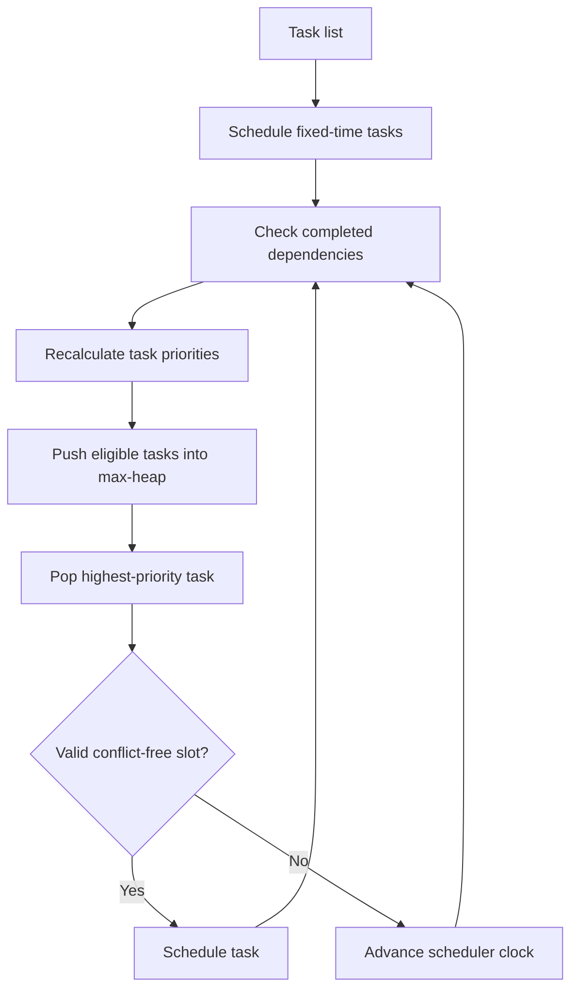

# Constraint-Aware Task Scheduler

A priority-based task scheduler in Python that handles **dependencies, fixed-time tasks, bounded time windows, duration, urgency, and schedule conflicts** using a custom max-heap priority queue.

The project began as an algorithms and data-structures assignment and was reorganized here as a small software-engineering project with a reusable module, tests, an example, and a benchmark.

## Highlights

- Implements a **max-heap from scratch** for priority-based task selection
- Supports fixed-time, flexible, and time-window tasks
- Enforces task dependencies before dependent work can be scheduled
- Recomputes priorities as the day progresses
- Detects overlapping time conflicts
- Includes automated tests for heap behavior, ordering invariance, dependencies, and fixed-time conflicts
- Stress-tested the scheduling design from **10 to 1,000 tasks**
- Identified conflict checking as the main worst-case **O(n²)** bottleneck

## How the priority works

Each task receives a heuristic score based on dependencies, duration, and urgency:

```text
priority = 100
           - dependency penalty
           - duration penalty
           + urgency bonus
```

Fixed-time tasks receive a strong urgency bonus. Tasks whose dependencies are incomplete are temporarily excluded from the heap until they become schedulable.

## Scheduling flow



## Project structure

```text
constraint-aware-task-scheduler/
├── scheduler.py
├── example.py
├── benchmark.py
├── tests/
│   └── test_scheduler.py
├── requirements.txt
└── README.md
```

## Example

```python
from scheduler import Scheduler, Task

tasks = [
    Task(1, "Morning class", 90, time_window=8 * 60),
    Task(2, "Lunch", 60, time_window=(12 * 60, 14 * 60)),
    Task(3, "Research", 60),
    Task(4, "Write report", 90, dependencies=[3]),
]

scheduler = Scheduler(tasks, start_time=7 * 60, end_time=18 * 60)
scheduler.run()
```

Time is represented as minutes after midnight, so `8 * 60` means 08:00 and `(12 * 60, 14 * 60)` means a window from 12:00 to 14:00.

## Run it

```bash
git clone https://github.com/pedrohgp02/constraint-aware-task-scheduler.git
cd constraint-aware-task-scheduler

python example.py
```

The core scheduler uses only the Python standard library.

To run the benchmark:

```bash
pip install -r requirements.txt
python benchmark.py
```

## Tests

```bash
pip install pytest
pytest -q
```

The test suite covers:

- max-heap ordering
- empty-heap behavior
- schedule invariance to input order in the reference scenario
- dependency ordering
- conflicting fixed-time tasks

## Complexity

The custom heap supports insertion and removal in **O(log n)** time. However, the scheduler also scans the existing schedule when checking whether a candidate time slot overlaps another task.

If there are `s` already scheduled tasks, a conflict check is **O(s)**. Repeating this across the scheduling process creates an **O(n²)** worst-case bottleneck, which dominates the heap operations as the task set grows.

The original project benchmark generated increasingly large randomized task sets through **1,000 tasks** to study this behavior.

### Possible improvements

- Maintain a persistent heap instead of rebuilding priorities each iteration
- Index completed dependencies for cheaper status checks
- Use a more efficient interval structure for schedule conflict queries
- Add pause/resume tasks and configurable transition breaks
- Separate hard constraints from the heuristic objective more explicitly

## Design note

This is a **heuristic scheduler**, not a mathematical optimizer. The max-heap chooses the highest-priority currently eligible task, but the algorithm does not guarantee a globally optimal schedule.

That distinction is intentional: the project focuses on data structures, constraint handling, runtime tradeoffs, and explainable scheduling behavior.

## Tech

`Python` `Algorithms` `Data Structures` `Priority Queues` `Testing` `Complexity Analysis`

## Author

**Pedro Paiva**

[Portfolio](https://pedrohgp02.github.io/) · [GitHub](https://github.com/pedrohgp02) · [LinkedIn](https://www.linkedin.com/in/pedrohgpaiva/)
